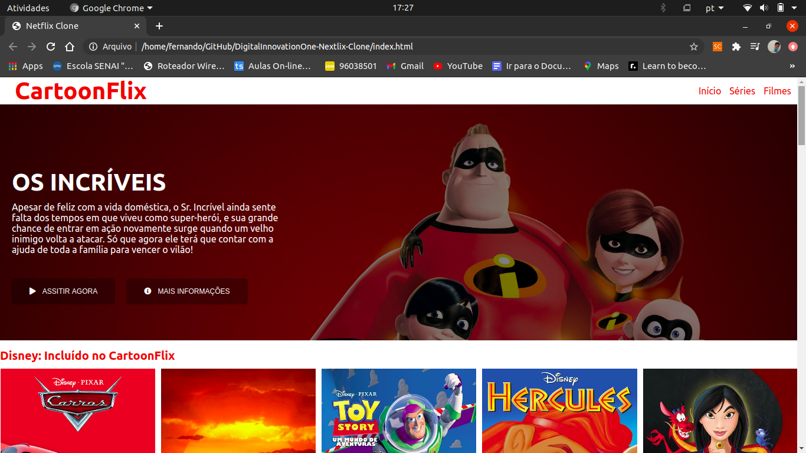

# CartoonFlix

<hr>



### Descrição
<hr>

Como parte das tarefas desenvolvidas no Bootcamp de Angular da plataforma Digital Innovation One desenvolvi um clone do Netflix mas com uma identidade visual diferente nomeada CartoonFlix.

### Funcionalidade principal

A funcionalidade aplicada nessa página é a possibilidade de ver a descrição de cada filme ou série clicando em cima da imagem do poster dele. Essas informações foram armazenadas em um objeto contendo as estruturas de matrizes.

### Tecnologias usadas

* HTML5
* CSS3
* JS

### Autor

```
Fernando Santos De Freitas
```
